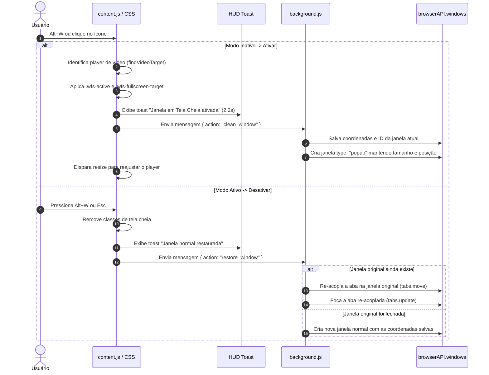

# Janela em Tela Cheia (Windowed Fullscreen) v1.3.0

Extensão de navegador universal (**Manifest V3**) para **Firefox**, **Google Chrome**, **Brave** e **Microsoft Edge**, desenvolvida para transformar reprodutores de vídeo da web em **tela cheia restrita à janela atual**, ideal para telas divididas (*split screen* 1/2, 1/3, 1/4) e multitarefa em alta produtividade.

---

## Objetivo e Motivação

Quando usamos o modo tela cheia padrão dos navegadores (F11 ou o botão nativo do YouTube/Netflix), o vídeo consome **100% da tela física do monitor**, quebrando layouts multitarefa (como Windows Snap, FancyZones ou tiling window managers).

A extensão **Janela em Tela Cheia** resolve isso ao:
1. Isolar a aba atual em uma janela estilo *popup* (sem barra de abas, sem barra de URLs e sem bordas desnecessárias).
2. Manter estritamente as coordenadas e proporções exatas da divisão da janela (ex.: 960x1080 em divisão meio a meio).
3. Expandir o player de vídeo para ocupar `100vw` × `100vh`, ocultando cabeçalhos, chats, comentários e recomendações.
4. Re-acoplar a aba à sua janela original de abas de forma inteligente ao desativar o modo.
5. Preservar os controles nativos do player e a decodificação de vídeo acelerada por hardware (inclusive streamings protegidos por DRM Widevine).

---

## Recursos Implementados (v1.3.0)

*  **Compatibilidade Multi-Navegador Nativa**: Suporte total a **Firefox** (AMO) e **Chromium** (Chrome, Edge, Brave, Opera) através do shim universal `browserAPI = globalThis.browser || globalThis.chrome`.
*  **Suporte Amplo a Streamings**:
  * **YouTube**: Acionamento nativo da classe `.ytp-fullscreen` e ocultação de header, sugestões, chat e comentários.
  * **Netflix**: Detecção dos contêineres `.watch-video` e preservação dos controles.
  * **Twitch**: Suporte ao `.video-player__container` e `.persistent-player` com ocultação automática do painel lateral de chat (`.channel-root__right-column`).
  * **Amazon Prime Video**: Suporte a `.webPlayerSDKContainer` e ocultação de barras de navegação do Prime.
  * **Disney+**: Suporte ao `#hls-player` e `.btm-media-client-element`.
  * **Max / HBO**: Suporte a `[data-testid="player-video-container"]` e `.default-player-container`.
  * **Crunchyroll**: Suporte ao `#player0` e `.vilos-player`.
  * **HTML5 Genérico**: Algoritmo heurístico que sobe a árvore DOM do `<video>` ativo para encontrar o container dimensional correspondente.
*  **Re-acoplamento Inteligente de Abas**:
  * Ao desativar, a extensão verifica se a janela original da qual a aba se desprendeu ainda existe.
  * Se existir, move a aba de volta para a janela original e foca a aba.
  * Se a janela original tiver sido fechada, cria uma nova janela normal restaurando as coordenadas anteriores.
*  **HUD Toast Notification (Glassmorphism)**:
  * Aviso visual suave e moderno na tela ao ativar (*"Janela em Tela Cheia ativada - Alt+W ou Esc para sair"*) e ao desativar (*"Janela normal restaurada"*).
  * Construído com `backdrop-filter: blur`, fundo translúcido, transições fade fluidas e `pointer-events: none` (não intercepta nenhum clique do usuário).
*  **Identidade Visual & Ícones Nativos**:
  * Ícone master vetorial SVG (`icons/icon.svg`) com estética de janela em expansão e gradiente ciano/índigo.
  * Gerador autônomo em Node.js puro (`scripts/generate_icons.mjs`) que desenha ícones PNG com *Signed Distance Fields* (SDF) e *Supersampling* (SSAA 4x4) nos tamanhos 16x16 (pixel-perfect), 32x32, 48x48 e 128x128.
*  **Build & Empacotamento Automatizado**:
  * Script `build.mjs` com gerador nativo de arquivos ZIP via `node:zlib` (sem dependências externas) que produz pacotes prontos para Firefox (`dist/JanelaTelaCheia-firefox.zip`) e Chromium (`dist/JanelaTelaCheia-chrome.zip`).
*  **Suíte de Testes 100% Nativa**:
  * 11 testes unitários e de integração executados com `node --test` (zero dependências npm).

---

## 📁 Estrutura do Projeto

```text
JanelaTelaCheia/
├── manifest.json              # Manifesto base da extensão (Manifest V3)
├── background.js              # Service worker / background script: gerenciamento de janelas e atalhos
├── content.js                 # Content script: detecção de players, atalhos e HUD Toast
├── content.css                # Estilos: tela cheia 100vw x 100vh, ocultação de UI e Toast glassmorphism
├── package.json               # Configurações do projeto e scripts npm (test, build)
├── build.mjs                  # Script de empacotamento para Chrome e Firefox (gera dist/)
├── README.md                  # Documentação completa
├── icons/                     # Identidade visual da extensão
│   ├── icon.svg               # Ícone vetorial SVG master
│   ├── icon-16.png            # 16x16 px (pixel-perfect para abas e barra de ferramentas)
│   ├── icon-32.png            # 32x32 px (telas Retina / HiDPI)
│   ├── icon-48.png            # 48x48 px (gerenciador de extensões)
│   └── icon-128.png           # 128x128 px (Chrome Web Store e Mozilla AMO)
├── scripts/
│   └── generate_icons.mjs     # Gerador de ícones PNG em Node.js puro com SDF e SSAA
├── dist/                      # Gerado pelo build (ignorado no git)
│   ├── firefox/               # Build descompactado para Mozilla Firefox
│   ├── chrome/                # Build descompactado para Google Chrome / Chromium
│   ├── JanelaTelaCheia-firefox.zip
│   └── JanelaTelaCheia-chrome.zip
└── tests/
    └── extension.test.mjs     # 11 testes automatizados nativos com node:test
```

---

##  Fluxo de Funcionamento



---

## ⌨️ Atalhos de Teclado

| Atalho | Ação | Contexto |
| :--- | :--- | :--- |
| `Alt + W` | Ativar / Desativar Tela Cheia na Janela | Em qualquer aba de vídeo |
| `Escape` | Sair do modo Tela Cheia na Janela | Quando o modo estiver ativo |
| Clique no ícone | Alternar Tela Cheia na Janela | Na barra de ferramentas do navegador |

---

##  Testes Automatizados

O projeto utiliza o test runner nativo do Node.js (`node:test` e `node:assert`).

```bash
npm test
```

### Casos de teste cobertos (11/11):
1. **Manifest.json e Ícones**: Versão 1.3.0, comandos, permissões e referências completas aos ícones.
2. **CSS e Decodificação de Vídeo**: Ausência de regras destrutivas na tag `<video>`.
3. **Prevenção de Injeções no content.js**: Flag `__wfs_injected` e seletores.
4. **Proteção de Janelas e Re-acoplamento no background.js**: Mutex `isSwitching`, shim `browserAPI` e re-acoplamento via `tabs.move`.
5. **Enquadramento em Diferentes Resoluções**: Validação geométrica para 1/4 Full HD, 1/2 vertical, 1/3 Ultrawide, 4K e Notebook.
6. **Suporte Expandido a Streamings**: YouTube, Netflix, Twitch, Prime Video, Disney+, Max, Crunchyroll e Toast HUD.
7. **Estilos e Ocultação de Interface**: Regras CSS de chat da Twitch, navegação do Prime e animações do Toast.
8. **Assets Visuais**: Integridade do SVG master e validação binária dos PNGs (assinatura RFC e headers IHDR).
9. **package.json**: Metadados, type module e scripts de ciclo de vida.
10. **Build & Distribuição**: Execução de `build.mjs` e validação dos pacotes de Firefox e Chrome em `dist/`.
11. **Simulação Funcional em Sandbox**: Mock do ambiente de background testando re-acoplamento de abas e fallback.

---

##  Como Compilar e Instalar

### 1. Compilar os pacotes
```bash
npm run build
```
Os pacotes serão gerados no diretório `dist/`.

### 2. Instalar no Firefox:
1. Abra o Firefox e acerte `about:debugging#/runtime/this-firefox`.
2. Clique em **"Carregar extensão temporária..."** (*Load Temporary Add-on*).
3. Selecione o arquivo `dist/JanelaTelaCheia-firefox.zip` ou o `manifest.json` da pasta `dist/firefox/`.

### 3. Instalar no Google Chrome / Brave / Edge:
1. Acesse `chrome://extensions` (ou `edge://extensions` / `brave://extensions`).
2. Ative o **"Modo do desenvolvedor"** no canto superior direito.
3. Clique em **"Carregar sem compactação"** (*Load unpacked*).
4. Selecione a pasta `dist/chrome/`.

---

## 📄 Licença

Distribuído sob a licença [MIT](file:///C:/Users/vinic/Desktop/2026.2/JanelaTelaCheia/LICENSE).
